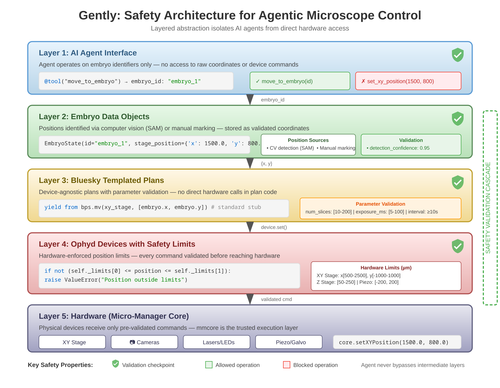
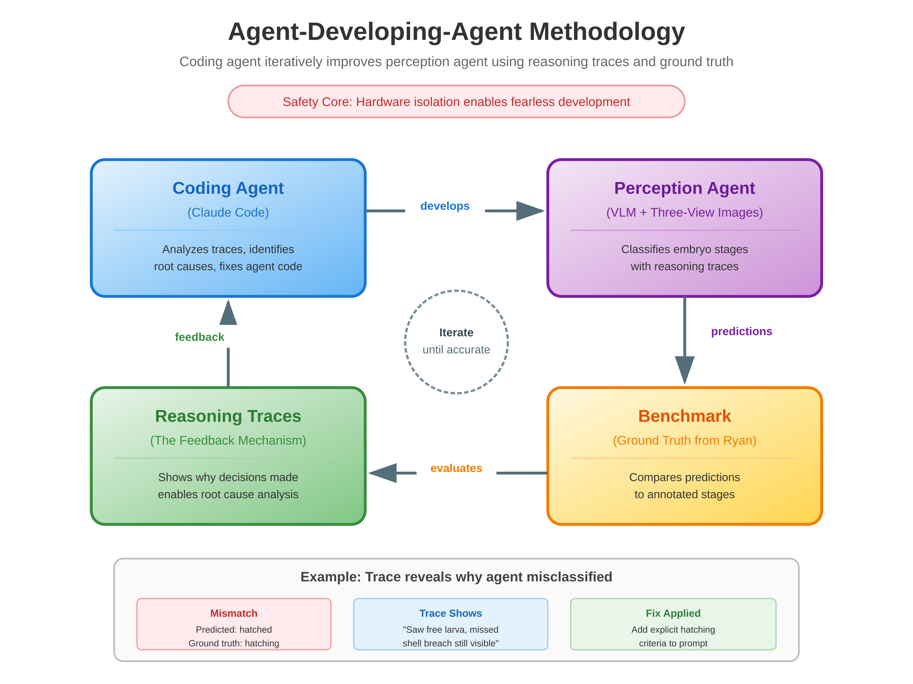

# Gently

Agentic harness for microscopy.

**Status**: 0.22.0.dev0 — actively developed at Shroff Lab, Janelia.



## Vision

Smart microscopy has evolved dramatically, but remains fundamentally rule-based. Adaptive illumination, event-triggered acquisition, real-time segmentation: these systems don't *understand* what they're imaging. There's a semantic gap between what microscopes measure (pixels, intensities) and what biologists care about (developmental stages, cell health, experimental outcomes).

Vision language models can bridge this gap through semantic reasoning over images. But how do you integrate VLMs with microscope hardware?

## Two Approaches

There's a useful distinction between [workflows and agents](https://www.anthropic.com/engineering/building-effective-agents): workflows orchestrate AI through predefined code paths, while agents dynamically direct their own tool usage.

**Workflow approach**: VLMs at specific decision points (classification, quality checks, event detection) within a traditional control system. Predictable, but rigid.

**Agentic approach**: The microscope exposed as tools an agent calls autonomously. Flexible, but risky without safety guarantees.

Gently supports both. Our **orchestrator agent** and **perception agent** operate agentically, while **calibration workflows** use VLMs at specific decision points (coverage detection, focus assessment). The safety architecture makes either pattern safe to experiment with.

## Safety Stack

Multiple independent layers of protection:

| Layer | Protection |
|-------|------------|
| **Process Isolation** | HTTP API separates agent from device layer. Client crashes don't affect the microscope. |
| **Device Limits** | Hard bounds validated in `set()` before any motion. Stage, piezo, galvo all protected. |
| **Plan Constraints** | Bluesky plans use a restricted vocabulary of safe primitives. |
| **Templated Actions** | Agents work with `Embryo` objects, not raw coordinates. |
| **Automatic Cleanup** | Try-finally patterns ensure lasers off on any error. |

This means: **bring your risky code**. AI-generated plans, experimental perception, coding agents iterating on control logic. The device layer catches errors before they reach hardware.

## We Welcome Coding Agents

Gently is designed for AI-assisted development. The safety stack exists precisely so that coding agents can iterate rapidly without risking hardware.



Our **agent-developing-agent methodology**: coding agents generate perception systems, test against benchmarks, analyze reasoning traces to identify failures, and refine. AI improving AI, with humans providing ground truth and guidance.

## Current Implementation

- **Hardware**: Dual-view selective plane illumination microscope (diSPIM)
- **Sample**: *C. elegans* embryo development (8 morphological stages)
- **Perception**: VLM-based stage classification with full reasoning traces
- **Interface**: Natural language agent for biologists

### Sample-Oriented Interface

The sample is the basic unit of data, not the image or the acquisition. Each sample carries:
- Live imagery and timelapse history
- Calibration state
- Perception traces exposing all classification reasoning
- Detector configurations and event history

This design makes AI decision-making fully observable, addressing a key barrier to AI adoption in scientific instrumentation.

Currently, the sample abstraction is the `Embryo` object for *C. elegans* work. The pattern generalizes to other sample types through the plugin system — organism and hardware modules are swappable.

## Quick Start

### Prerequisites

- Python 3.10+
- An `ANTHROPIC_API_KEY` environment variable
- *(Optional)* `GENTLY_STORAGE_PATH` — where sessions and data live (default `D:/Gently3`)

Gently is **web-first**: the agent is driven from an in-page chat in your
browser. There is no TUI to build (Node.js is only needed for the paper
diagrams, not the app).

### Setup

```bash
git clone https://github.com/pskeshu/gently.git
cd gently
```

Then create an environment and install — **either path works**:

```bash
# venv + pip
python -m venv .venv
source .venv/bin/activate          # Windows: .venv\Scripts\activate
pip install -e .                   # installs the gently package + dependencies
```

```bash
# or uv (https://docs.astral.sh/uv/) — faster, no separate activation step
uv venv
uv pip install -e .
```

### Launch

> **uv users:** either activate the env first (`source .venv/bin/activate`) or prefix the commands below with `uv run` (e.g. `uv run python launch_gently.py`).

```bash
# 1. Device layer (hardware control + SAM detection) — separate process, own terminal
python start_device_layer.py

# 2. Agent + web UI (starts the in-process server and opens your browser)
python launch_gently.py

# Run without hardware (development / review)
python launch_gently.py --offline

# Don't auto-open a browser — open the printed URL yourself
python launch_gently.py --no-browser

# Resume a previous session
python launch_gently.py --resume            # interactive picker
python launch_gently.py --resume latest     # most recent session
python launch_gently.py --resume <id>       # specific session

# Verbose / debug logging
python launch_gently.py -v                  # INFO level
python launch_gently.py --debug             # DEBUG level
```

The launcher prints a banner with the URL (default `http://localhost:8080`),
device status, storage path, and log location. Open that URL in any browser on
the LAN.

### First sign-in (accounts)

**Viewing is open** — the dashboard loads read-only for anyone, no login.
Signing in *elevates* you to control (driving hardware, taking the
single-operator lock); it isn't a gate on the page.

On the **first run**, Gently creates one `admin` account and prints a one-time
random password in the startup banner:

```
First-run admin account created — sign in at the URL above:
    username: admin
    password: <random>
```

- **Save it now** — the password is printed to the console once and never
  written to the log (only a PBKDF2 hash is stored).
- After signing in, add accounts (roles `viewer` / `operator` / `admin`) via the
  admin-only `POST /api/auth/users`.
- **Lost it?** There's no reset command yet — delete
  `<GENTLY_STORAGE_PATH>/auth/users.yaml` and restart to bootstrap a fresh
  `admin` (this clears all accounts).
- **Just trying it locally?** `GENTLY_NO_AUTH=1` disables accounts entirely
  (legacy mode: localhost gets control, remote callers need `X-Gently-Token`).

Accounts live under `<GENTLY_STORAGE_PATH>/auth/` (`users.yaml` + `secret.key`),
outside the repo.

## Make your first plan

You don't need a microscope to try the core loop — **plan mode is pure agent reasoning and works under `--offline`**. The path from launch to an inspectable plan:

1. **Open the agent chat.** Click **Agent** in the header (or press `Ctrl`/`Cmd`+`J`). New here? The **Home** tab's *Start an experiment* button runs a short setup wizard (also available anytime via `/wizard` — it sets the organism, the campaign, and what you're trying to learn).
2. **Enter plan mode** — type `/plan` in the chat. The agent switches from *operator* to *scientific collaborator*: it won't touch hardware, it helps you design an experiment.
3. **Describe what you want, in plain language.** For example:
   > *"Follow GFP-tagged embryos from bean stage through elongation, imaging every 10 minutes, with a no-laser control — three embryos per condition."*

   The agent drafts a **campaign**: a sequence of typed **plan items** — imaging 📷, bench 🧪, genetics 🧬, analysis 📊, decision points 🚦 — each with concrete specs (strain, interval, laser power, Z-slices, target window, success criteria). Keep replying to refine it; `/plan status` shows progress and `/plan exit` returns to run mode.
4. **Inspect it in the plan viewer.** Open the **Plans** tab. Your campaign appears as a card — click it to open the **plan document**. Each item shows its status (○ planned · ◑ in progress · ● done) and specs; click one to see full details in the inspector. Switch layouts (document / board / graph / timeline) from the view controls, and browse plan **versions** as it evolves. (Typing `/campaign` in chat lists campaigns too.)

That's the loop: **talk → plan → inspect.** With hardware connected (drop `--offline` and start the device layer), the same campaign drives acquisition — and perception events can wake the agent to adjust it as the embryos develop.

## Guides

| Guide | Audience | What you'll learn |
|-------|----------|-------------------|
| [Documentation Home](docs/index.md) | Everyone | Browse the generated-docs structure for Gently |
| [Full Stack Microscopy](docs/full-stack-microscopy.md) | Everyone | How intent, samples, hardware, perception, data, and operators fit together |
| [Try Without Hardware](docs/guides/try-offline.md) | Everyone | Run the agent in 10 minutes — conversation, plan mode, perception |
| [What Gently Can Do](docs/guides/capabilities.md) | Everyone | Perception, detection, plan mode, memory, mesh, safety |
| [Build a Plugin](docs/guides/build-a-plugin.md) | Developers | Create organism and hardware plugins for other modalities |
| [Hardware Setup](docs/guides/hardware-setup.md) | Labs | Connect a diSPIM, start the device layer, first acquisition |
| [Sample & Hardware Model](docs/architecture/sample-hardware-domains.md) | Developers | Generalize samples, hardware operations, and device-profile boundaries |
| [Sample Tracking Metrics](docs/architecture/sample-tracking-metrics.md) | Developers | Define reusable sample state, exposure, focus, and perception metrics |
| [Hardware Profile Template](docs/architecture/hardware-profile-template.md) | Developers | Checklist for adding or documenting a new microscope profile |

## Architecture

Four layers with strict downward-only dependencies. The **harness** (reusable agent framework) is separated from the **application** (microscopy agent), with organism and hardware as swappable plugins.

```
gently/
├── core/                  # Layer 1: Foundation — zero domain knowledge
│   ├── event_bus.py       #   Async pub/sub messaging
│   ├── file_store.py      #   FileStore (file-based: YAML / JSONL / TIF)
│   ├── imaging.py         #   Projection, normalization, encoding
│   └── coordinates.py     #   Pixel/stage transforms
│
├── harness/               # Layer 2: Reusable agent framework
│   ├── tools/             #   @tool decorator, ToolRegistry
│   ├── perception/        #   VLM-based observation with reasoning traces
│   ├── memory/            #   Persistent agent mind (campaigns, learnings)
│   ├── prompts/           #   Prompt engineering and context injection
│   ├── detection/         #   Event detection framework
│   ├── session/           #   Session lifecycle, interaction logging
│   ├── plan_mode/         #   Experimental design mode
│   ├── conversation.py    #   LLM conversation management
│   ├── bridge.py          #   WebSocket adapter
│   └── protocols.py       #   OrganismProtocol, HardwareProtocol
│
├── organisms/             # Layer 3: Swappable domain plugins
│   └── celegans/          #   C. elegans stages, biology, detectors
├── hardware/
│   └── dispim/            #   diSPIM devices, plans, config, device layer
│
├── app/                   # Layer 4: The microscopy agent
│   ├── agent.py           #   MicroscopyAgent orchestrator
│   ├── tools/             #   19 domain-specific tool modules
│   └── orchestration/     #   Timelapse, plan synthesis, ML subagent
│
├── ui/web/                # FastAPI viz server + web assets
├── mesh/                  # Distributed multi-instrument coordination
├── ml/                    # ML training infrastructure
└── analysis/              # Focus analysis utilities
```

Building a different microscopy agent (e.g. confocal + Drosophila) means writing a new organism plugin, a new hardware plugin, and optionally custom tools — the harness, core, and analysis layers are reused unchanged.

## Contributing

We welcome contributions across the project:

**Core Infrastructure**
- **Devices**: Be careful. Changes here affect hardware safety. Add tests.
- **Plans**: Follow Bluesky conventions. Plans should be composable and device-agnostic.
- **Simulated microscopes**: Simulated hardware for testing across the stack without real instruments.
- **Testing**: Test coverage, integration tests, edge cases.
- **Error recovery**: Better failure modes, graceful degradation.
- **Performance**: Making things faster and more efficient.

**AI & Agents**
- **Agent/perception**: Experiment freely. The safety stack has your back. The harness layer (`gently/harness/`) is designed for reuse.
- **Design patterns**: Reusable patterns for LLM/agentic control in microscopy. If it can be a module, even better.
- **Cognitive models**: Thinking cognitively about microscopy and implementing cognitive computing models.
- **Local LLMs**: We currently use cloud providers. Support for local models would be valuable.
- **Benchmark datasets**: Ground truth annotations for perception. The agent-developing-agent loop needs data.

**Architecture & Scope**
- **System architecture**: Ideas on how to structure agentic microscopy systems.
- **Sample abstractions**: The `Embryo` object is our first sample type. What works for cells, tissue, other specimens?
- **Other microscopy platforms**: Write a new hardware plugin (`gently/hardware/<name>/`) and organism plugin (`gently/organisms/<name>/`). Confocal, widefield, other light-sheet systems, electron microscopy.
- **Multi-modal integration**: Combining microscopy with other data sources (genomics, proteomics, etc.).

**Human Interface**
- **UI/UX**: The web interface, agent experience, and visualization all need work.
- **HCI research**: How do biologists work with intelligent instruments?
- **Documentation**: Tutorials, examples, better explanations for newcomers.
- **Accessibility**: Making the interface accessible to users with disabilities.
- **Internationalization**: Supporting other languages for the agent.

Coding agents are welcome contributors.

**Questions or ideas?** [Open an issue](https://github.com/pskeshu/gently/issues).

## Acknowledgements

Gently was developed collaboratively with members of the [Shroff Lab](https://www.janelia.org/lab/shroff-lab), [Magdalena Schneider](https://schneidermc.github.io/) (AI@HHMI), and [Subin Dev S](https://github.com/subindevs).

## Publications

These papers provide theoretical background for gently's approach:

- Kesavan, P.S. & Nordenfelt, P. "From observation to understanding: A multi-agent framework for smart microscopy." *Journal of Microscopy* (2025). [DOI: 10.1111/jmi.70063](https://onlinelibrary.wiley.com/doi/10.1111/jmi.70063)
- Kesavan, P.S. & Bohra, D. "deepthought: domain driven design for microscopy with applications in DNA damage responses." *bioRxiv* (2025). [DOI: 10.1101/2025.02.25.639997](https://doi.org/10.1101/2025.02.25.639997)

## The Dream

**One microscope, made intelligent.** gently gives a microscope perception and reasoning — it understands what it's imaging, not just what it's measuring. A biologist talks to it in natural language. The safety stack means you can trust it.

**Now multiply that.** Every microscope running gently is an autonomous agent — it can perceive, reason, and act on its own instrument. Each one is a node with local intelligence.

**Connect the nodes.** [gently-meta](https://github.com/pskeshu/gently-meta) is a registry where these agents discover each other. Not a central brain — a shared awareness. Each instrument advertises what it can do, what it's working on, what it has seen.

**Science stops being bottlenecked by single instruments.** A genomics facility in Cambridge finds something unexpected. Microscopes in Boston, Tokyo, and Heidelberg are roped in to validate it across diverse samples and imaging modalities — automatically. The discovery-to-validation loop that currently takes months of emails and facility bookings happens in hours.

**Instruments become a shared, coordinated resource.** Discoveries in one modality trigger experiments in another. No single lab needs to own every capability. The collective sees more than any individual.

## License

See [LICENSE](LICENSE) file.
