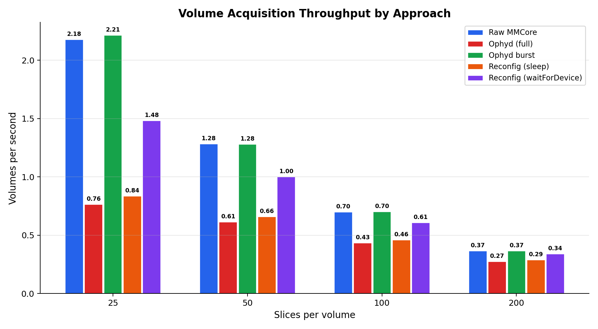
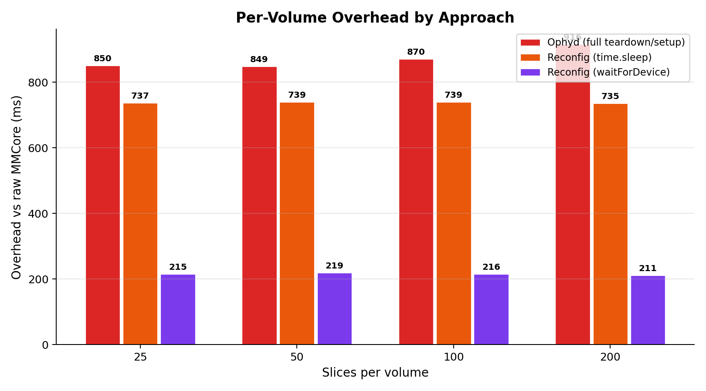
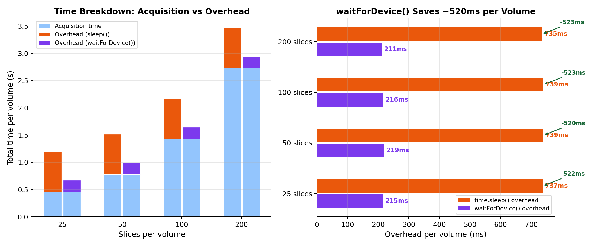
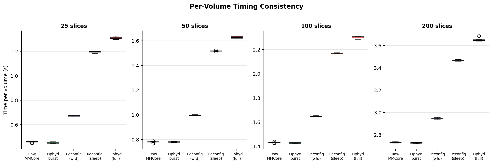

# Volume Scanning FPS Benchmark Report

**Date:** 2026-01-27
**System:** ASI diSPIM with Hamamatsu ORCA camera, ASI Tiger controller
**Software:** gently + dispim-control (ophyd/Bluesky device layer)

---

## Executive Summary

We benchmarked volume acquisition throughput on our diSPIM system to understand
where time is spent between volumes and identify optimization opportunities. Five
approaches were tested, sweeping from 25 to 200 slices per volume at 5 ms
exposure.

**Key findings:**

1. The ophyd device abstraction adds **zero overhead** when used in burst mode
   (configure once, re-trigger). All overhead comes from per-volume
   teardown/setup logic.

2. In round-robin multi-embryo acquisition, reconfiguring galvo/piezo between
   volumes adds **~737 ms** of overhead per volume -- but **~522 ms of that is
   unnecessary `time.sleep()` calls**.

3. Replacing `time.sleep()` with MMCore's `waitForDevice()` API reduces
   reconfig overhead from ~737 ms to **~215 ms** (70% reduction), yielding up to
   **77% higher throughput** for short volumes.

---

## Test Configuration

| Parameter | Value |
|-----------|-------|
| Camera | HamCam1 (Hamamatsu ORCA) |
| Scanner | Scanner:AB:33 (ASI Tiger galvo) |
| Piezo | PiezoStage:P:34 (ASI Tiger piezo) |
| Exposure | 5.0 ms |
| Camera ROI | 128, 896, 2048, 512 |
| Camera mode | EXTERNAL trigger, PROGRESSIVE sensor, EDGE active |
| Galvo amplitude | 0.5 deg |
| Piezo amplitude | 25.0 um |
| Lasers | 488 nm + 561 nm |
| SPIM timing | scan_delay=6.75ms, scan=5.5ms, laser_delay=8.0ms, laser=5.0ms, cam_delay=8.0ms, cam=1.0ms |
| Slices tested | 25, 50, 100, 200 |
| Repeats | 10 measured + 2 warmup per configuration |
| Embryo profiles | 4 (for round-robin tests) |

---

## Approaches Tested

| Approach | Description |
|----------|-------------|
| **raw** | Direct MMCore API calls. Configure once, lasers stay on, minimal inter-volume reset (SPIM idle + piezo re-arm). Baseline. |
| **ophyd** | Full `DiSPIMVolumeScanner.trigger()` per volume. Enables/disables lasers, resets camera to INTERNAL trigger, full hardware teardown after each volume. |
| **ophyd_burst** | Ophyd devices configured once, then raw-style burst acquisition. No per-volume teardown. Tests whether the ophyd abstraction layer itself adds overhead. |
| **burst_reconfig** | Camera/laser configured once, galvo Y-axis and piezo amplitude/center changed per volume (simulates round-robin multi-embryo). Uses `time.sleep()` for hardware settling. |
| **reconfig_wfd** | Identical to burst_reconfig but replaces all `time.sleep()` calls with `core.waitForDevice()`. Tests whether ASI Tiger reports accurate device busy status. |

---

## Results

### Throughput (volumes per second)

| Slices | Raw MMCore | Ophyd (full) | Ophyd burst | Reconfig (sleep) | Reconfig (wfd) |
|-------:|----------:|-------------:|------------:|-----------------:|---------------:|
| 25     | **2.18**  | 0.76         | 2.21        | 0.84             | **1.48**       |
| 50     | **1.28**  | 0.61         | 1.28        | 0.66             | **1.00**       |
| 100    | **0.70**  | 0.43         | 0.70        | 0.46             | **0.61**       |
| 200    | **0.37**  | 0.27         | 0.37        | 0.29             | **0.34**       |

### Per-Volume Timing (seconds)

| Slices | Approach | Mean | Std | Min | Max |
|-------:|----------|-----:|----:|----:|----:|
| 25 | raw | 0.459 | 0.006 | 0.448 | 0.463 |
| 25 | ophyd | 1.309 | 0.009 | 1.298 | 1.325 |
| 25 | ophyd_burst | 0.452 | 0.005 | 0.445 | 0.461 |
| 25 | burst_reconfig | 1.196 | 0.006 | 1.185 | 1.202 |
| 25 | reconfig_wfd | 0.674 | 0.006 | 0.664 | 0.680 |
| 50 | raw | 0.780 | 0.006 | 0.767 | 0.788 |
| 50 | ophyd | 1.628 | 0.009 | 1.614 | 1.638 |
| 50 | ophyd_burst | 0.781 | 0.003 | 0.776 | 0.786 |
| 50 | burst_reconfig | 1.518 | 0.003 | 1.513 | 1.524 |
| 50 | reconfig_wfd | 0.998 | 0.004 | 0.994 | 1.005 |
| 100 | raw | 1.432 | 0.005 | 1.424 | 1.440 |
| 100 | ophyd | 2.302 | 0.009 | 2.286 | 2.312 |
| 100 | ophyd_burst | 1.427 | 0.005 | 1.421 | 1.435 |
| 100 | burst_reconfig | 2.171 | 0.005 | 2.166 | 2.179 |
| 100 | reconfig_wfd | 1.648 | 0.004 | 1.643 | 1.654 |
| 200 | raw | 2.733 | 0.004 | 2.727 | 2.739 |
| 200 | ophyd | 3.649 | 0.014 | 3.634 | 3.684 |
| 200 | ophyd_burst | 2.729 | 0.005 | 2.721 | 2.737 |
| 200 | burst_reconfig | 3.468 | 0.006 | 3.459 | 3.475 |
| 200 | reconfig_wfd | 2.945 | 0.005 | 2.940 | 2.954 |

### Overhead vs Raw MMCore

| Slices | Ophyd (full) | Reconfig (sleep) | Reconfig (wfd) |
|-------:|-------------:|-----------------:|---------------:|
| 25     | +850 ms      | +737 ms          | **+215 ms**    |
| 50     | +849 ms      | +739 ms          | **+219 ms**    |
| 100    | +870 ms      | +739 ms          | **+216 ms**    |
| 200    | +916 ms      | +735 ms          | **+212 ms**    |

---

## Analysis

### 1. Ophyd Abstraction: Zero Cost

Comparing **raw** vs **ophyd_burst** shows the ophyd device layer itself adds
no measurable overhead:

| Slices | Raw (s) | Ophyd burst (s) | Difference |
|-------:|--------:|-----------------:|-----------:|
| 25     | 0.459   | 0.452            | -7 ms      |
| 50     | 0.780   | 0.781            | +1 ms      |
| 100    | 1.432   | 1.427            | -5 ms      |
| 200    | 2.733   | 2.729            | -4 ms      |

The differences are within measurement noise. The ophyd Python wrapper around
MMCore property calls adds effectively zero latency. **All overhead in the
"ophyd (full)" approach comes from per-volume teardown/setup logic**, not from
the abstraction layer.

### 2. Full Ophyd Teardown: ~850 ms Overhead

The full `DiSPIMVolumeScanner.trigger()` method performs these operations
between every volume:

| Operation | Estimated time |
|-----------|---------------|
| Enable lasers + `waitForConfig` + sleep(0.1) | ~110 ms |
| `prepareSequenceAcquisition` + sleep(0.1) | ~100 ms |
| `startSequenceAcquisition` + sleep(0.1) | ~100 ms |
| Reset camera trigger to INTERNAL | ~10 ms |
| Scanner `SPIMState=Idle` + sleep(0.2) | ~200 ms |
| Piezo `SPIMState=Idle` | ~10 ms |
| Disable lasers + `waitForConfig` | ~20 ms |
| **Subtotal (inter-volume)** | **~550 ms** |
| Piezo `SPIMState=Armed` + sleep(0.3) (next configure) | ~300 ms |
| **Total** | **~850 ms** |

This is necessary for single-volume safety (lasers off between acquisitions)
but wasteful in burst/timelapse scenarios.

### 3. Round-Robin Reconfig: `time.sleep()` Dominates

The `burst_reconfig` approach keeps camera/lasers configured and only changes
galvo/piezo per volume. Its ~737 ms overhead breaks down as:

| Operation | `time.sleep()` used | Actual hardware time |
|-----------|-------------------:|---------------------:|
| Galvo Y-axis property changes | 0 ms | ~5 ms |
| Piezo amplitude/center changes | 0 ms | ~5 ms |
| Piezo `SPIMState=Armed` | **300 ms** | ~? |
| `prepareSequenceAcquisition` | **100 ms** | ~? |
| `startSequenceAcquisition` | **100 ms** | ~? |
| Scanner `SPIMState=Idle` (inter-volume) | **200 ms** | ~? |
| **Total sleeps** | **700 ms** | |
| Remaining (serial comms, etc.) | | ~37 ms |

### 4. `waitForDevice()` Optimization: 70% Overhead Reduction

Replacing `time.sleep()` with `core.waitForDevice()` reduced per-volume
overhead from ~737 ms to ~215 ms across all slice counts:

| Slices | sleep overhead | wfd overhead | Saved | Throughput gain |
|-------:|---------------:|-------------:|------:|----------------:|
| 25     | 737 ms         | 215 ms       | **522 ms** | **+77%** |
| 50     | 739 ms         | 219 ms       | **520 ms** | **+52%** |
| 100    | 739 ms         | 216 ms       | **523 ms** | **+32%** |
| 200    | 735 ms         | 212 ms       | **523 ms** | **+18%** |

The consistent ~215 ms residual overhead represents **real hardware settling
time** -- the piezo physically moving to its armed position, the camera
preparing its DMA buffers, and serial communication round-trips. This cannot be
reduced through software.

The consistent ~522 ms savings confirms that over 70% of the original sleep
time was unnecessary waiting.

### 5. Timing Consistency

All approaches show excellent repeatability with standard deviations of 3-14 ms
(< 1% coefficient of variation). The `reconfig_wfd` approach is just as
consistent as the sleep-based approaches, confirming that `waitForDevice()` is a
reliable synchronization mechanism.

---

## Recommendations

### Immediate: Update `devices.py` Sleep Calls

Replace all `time.sleep()` calls in the ophyd device layer with
`core.waitForDevice()`:

| File:Line | Current | Recommended |
|-----------|---------|-------------|
| `devices.py:768` (DiSPIMPiezo.set_spim_state) | `time.sleep(0.3)` | `self.core.waitForDevice(self.name)` |
| `devices.py:999` (DiSPIMScanner.set_spim_state) | `time.sleep(0.2)` | `self.core.waitForDevice(self.name)` |
| `devices.py:1481` (VolumeScanner.trigger) | `time.sleep(0.1)` after prepareSequence | `self.core.waitForDevice(camera)` |
| `devices.py:1483` (VolumeScanner.trigger) | `time.sleep(0.1)` after startSequence | `self.core.waitForDevice(camera)` |
| `devices.py:1470` (VolumeScanner.trigger) | `time.sleep(0.1)` after laser config | Remove (waitForConfig already called) |
| `devices.py:1057` (DiSPIMScanner.set_y_offset) | `time.sleep(0.3)` | `self.core.waitForDevice(self.name)` |
| `devices.py:1133` (DiSPIMScanner.configure_idle) | `time.sleep(0.3)` | `self.core.waitForDevice(self.name)` |
| `devices.py:828` (GalvoAxisSignal.set) | `time.sleep(0.3)` | `self.core.waitForDevice(scanner)` |

### Future: Burst Mode for Multi-Embryo Timelapse

For the round-robin multi-embryo timelapse use case, implement a burst
acquisition mode in `DiSPIMVolumeScanner` that:

1. Configures camera, laser, scanner X-axis, and SPIM timing **once**
2. Keeps lasers on for the entire round-robin cycle
3. Only updates galvo Y-axis and piezo per volume
4. Uses `waitForDevice()` for synchronization

This would achieve ~215 ms reconfig overhead per embryo switch instead of the
current ~850 ms, enabling near-raw-speed round-robin acquisition.

---

## Appendix: Benchmark Infrastructure

- **Script:** `diagnostics/benchmark_volume_fps.py`
- **Plotting:** `diagnostics/plot_benchmark_results.py`
- **Raw data:** `results/benchmark_volume_fps_20260127_*.csv`
- **Hardware timing:** `time.perf_counter()` (sub-ms resolution)
- **Methodology:** Each configuration runs 2 warmup + 10 measured volumes.
  Image data is discarded (not saved to disk) to avoid I/O bias. The timer for
  raw/ophyd_burst spans from SPIM state set to Running through all images
  collected. The timer for reconfig approaches includes galvo/piezo property
  changes.

### Effective Per-Slice Rate

All approaches achieve the same per-slice acquisition rate, confirming the
hardware-triggered SPIM timing is identical:

| Slices | Raw time (s) | Per-slice (ms) | Theoretical (ms) |
|-------:|-----------:|---------------:|------------------:|
| 25     | 0.459      | 18.4           | ~14 ms (scan+overhead) |
| 50     | 0.780      | 15.6           | ~14 ms |
| 100    | 1.432      | 14.3           | ~14 ms |
| 200    | 2.733      | 13.7           | ~14 ms |

Per-slice time approaches the theoretical ~14 ms (scan_delay + scan_duration +
margin) at higher slice counts, with fixed per-volume overhead amortized away.
