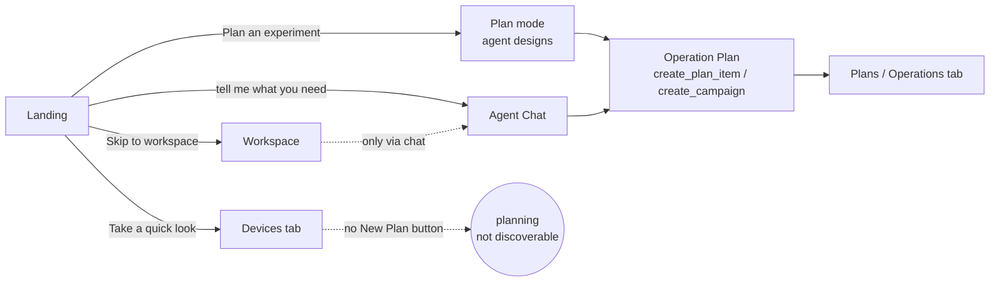

# Gently — User Stories & UX Flows

The jobs users come to gently to do, one file per story, each with a **Mermaid
user-flow** and a code-grounded status. This is the map the product is audited
against. Runtime model: [`../ARCHITECTURE.md`](../ARCHITECTURE.md).

## How this is mapped (the standard)

We use **diagram-as-code (Mermaid) in markdown** so flows are version-controlled
and render on GitHub:
- **Story catalog** (this dir) = the user-story map backbone.
- **User flow** = a `flowchart` in each story file.
- **State diagram** = `stateDiagram-v2` for stateful surfaces (Operate spine, run lifecycle).
- **Service blueprint** = one end-to-end frontstage↔backstage map.

**Status legend:** ✅ works · ◑ partial / rough edge · ⚠ gap (dead-end / missing /
undiscoverable) · ⏳ needs on-rig hardware to fully verify.

## Entry points — overview flow

Tabs: home · experiment · embryos · plans · sessions · notebook · gallery ·
devices · calibration · events. Settings at `/settings`; login at `/login`.

## Stories

Grouped by cluster; each links to its own file (generated/refined from the
fan-out user-story audit + live browser walkthroughs).

| Cluster | Stories |
|---|---|
| 1 Onboarding | first-run landing · skip & resume · return to planning |
| 2 Planning (guided) | design with agent · review & commit |
| 3 Planning (access) | **new plan from workspace** ⚠ · edit plan · delete plan |
| 4 Standalone | quick-look scope · one-off acquire · promote to session |
| 5 Operate (mark) | mark embryos · center embryo · import embryos |
| 6 Operate (acquire) | lower SPIM→focus→acquire · run chooser · assign roles |
| 7 Timelapse | start · monitor · pause/stop/resume |
| 8 Operations/tactics | view plan · understand tactic · run tactic · library |
| 9 Temperature | configure thermalizer ✅ · setpoint · protocol · graph |
| 10 Perception | stages over time · inspect trace · ground truth · export |
| 11 Memory/campaigns | learnings · active mind · campaigns |
| 12 Notebook | read · ask |
| 13 Agent chat | chat/delegate · answer ask · steer/interrupt |
| 14 Config/session/mesh | settings · sessions · mesh · auth/control |

*Individual story files are being generated from the audit; the verified exemplar
is [`US-06-new-plan-from-workspace.md`](US-06-new-plan-from-workspace.md).*
