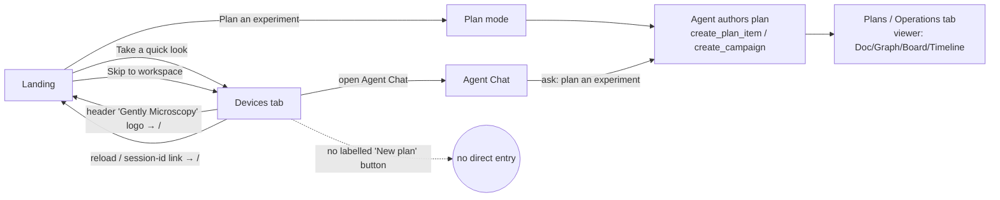

# US-06 — Start a new plan from the workspace

- **Cluster:** 3 · Planning (access)
- **As a** researcher already in the workspace (after "Take a quick look" or "Skip to workspace"),
  **I want to** start a new experiment plan,
  **so that** I can formalize what I'm doing without restarting the app.
- **Status:** ◑ partial — the workspace has no labelled "New plan" affordance, but
  planning **is** re-reachable (header logo → landing, or Agent Chat). *Crawler-verified 2026-07-01.*

## User flow (current, crawler-verified)

## Entry points
- **Header logo/title ("Gently Microscopy") → `/`** — returns to the landing (it has
  no persistence), where "Plan an experiment" is available again. This is the
  return path a user discovers by clicking the brand; it is not labelled as such.
- **Agent Chat** → ask the agent to plan.
- **Plans tab** → a *viewer/manager* of existing agent-authored plans + campaigns; no "create" action.

## Deficiency
Planning is not a *dead-end* from the workspace — but the only ways back are
**incidental** (clicking the header logo, which happens to reset to the entry
screen; reloading) or **tacit** (knowing to ask Agent Chat). There is **no
labelled "New plan" affordance**, so a user who wants to start a plan mid-session
has to stumble onto the logo→landing reset or already know the chat path.

## Suggested fix
Add a persistent, labelled **"+ New plan"** action (plans-tab header and/or a
workspace entry) that re-enters plan mode or opens Agent Chat pre-seeded with a
planning prompt; and let the plans-tab empty state offer "Design a plan with
Gently". Consider a visible "Home / start over" on the logo so its reset
behaviour is discoverable rather than accidental.

## Evidence
- `landing.js:777` — `openScope()` → `switchTab('devices')` (standalone lands in devices).
- The landing has no persistence and only a dead `V2Landing.show()` reopen API, so any
  navigation to `/` (logo, reload) re-shows it (`landing.js:44,867`).
- Plan creation is agent-tool driven: `create_plan_item`, `create_campaign` (`landing.js:218`).
- **UI crawler (`tools/ui_crawler`):** from the `devices`/`home` states it recorded
  8 *returns-to-landing* edges — via the header **"Gently Microscopy"** `<a>`, the
  `#session-id-link`, and the synthetic `__reload__` / `__goto_root__` actions. This is
  the affordance the static audit missed: static tracing saw "no persistence" but never
  walked the click that exploits it.
